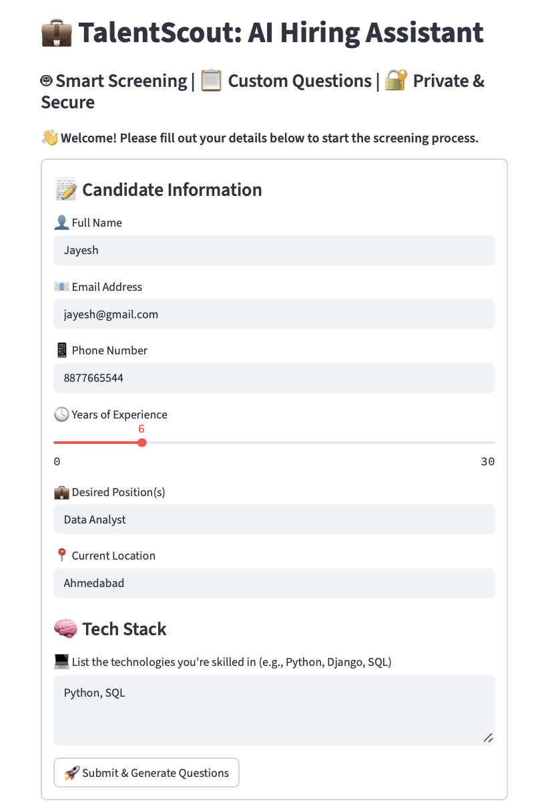

# 🤖 TalentScout - AI Hiring Assistant Chatbot

A smart, customizable AI chatbot that helps screen job candidates by collecting their information and generating technical interview questions based on their tech stack.

Built with:
- 💻 Python
- ⚡️ [Groq API](https://console.groq.com/)
- 🎨 Streamlit (Frontend)

---

## 🚀 Features

✅ Collects essential candidate details (name, contact info, experience, etc.)  
✅ Asks 3–5 **tech stack-based questions** using Groq-hosted LLMs  
✅ Powered by **LLMs like `llama3-8b` for fast responses**  
✅ Beautiful Streamlit UI with emojis, spinners, and responsive layout  
✅ Context-aware, simple, and expandable structure  
✅ Fallback and graceful conversation handling  
✅ Optional: Deploy on Streamlit Cloud or record Loom demo  

---

## 🖼️ Demo Preview




---

## 📦 Installation

### 1. Clone the Repository

```bash
git clone https://github.com/your-username/hiring-assistant-chatbot.git
cd hiring-assistant-chatbot
